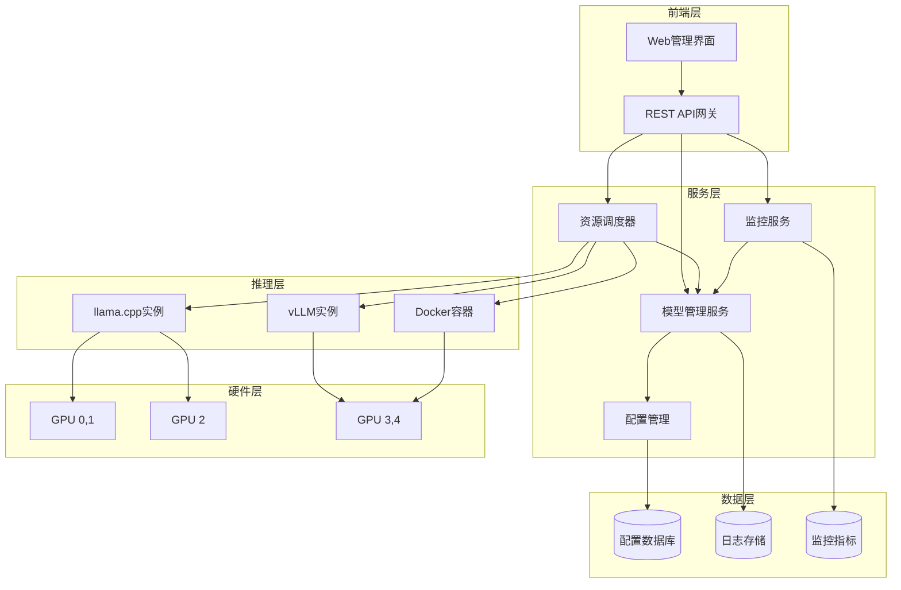

# 设计文档

## 概述

大模型推理服务是一个分布式系统，用于管理和调度多个AI模型在不同推理框架下的运行。系统采用微服务架构，包含核心管理服务、资源调度器、监控系统和Web前端界面。支持llama.cpp和vLLM框架，能够根据GPU资源可用性和模型优先级自动调度模型实例。

### 核心功能
- 多框架模型管理（llama.cpp、vLLM、Docker容器）
- 基于优先级的智能资源调度
- 实时系统监控和健康检查
- RESTful API和Web管理界面
- 配置持久化和故障恢复

## 架构

### 系统架构图



### 技术栈选择
- **后端框架**: FastAPI (Python) - 高性能异步API框架
- **前端框架**: Vue.js 3 + TypeScript - 现代响应式Web界面
- **数据库**: SQLite/PostgreSQL - 配置和状态持久化
- **消息队列**: Redis - 实时通信和缓存
- **监控**: Prometheus + Grafana - 指标收集和可视化
- **进程管理**: systemd/supervisor - 模型进程生命周期管理

## 组件和接口

### 1. 模型管理服务 (ModelManager)

负责模型的生命周期管理和配置验证。

#### 核心接口
```python
class ModelManager:
    async def create_model(self, config: ModelConfig) -> str
    async def start_model(self, model_id: str) -> bool
    async def stop_model(self, model_id: str) -> bool
    async def restart_model(self, model_id: str) -> bool
    async def get_model_status(self, model_id: str) -> ModelStatus
    async def list_models(self) -> List[ModelInfo]
    async def delete_model(self, model_id: str) -> bool
```

#### 支持的框架适配器
- **LlamaCppAdapter**: 管理llama.cpp进程
- **VllmAdapter**: 管理vLLM服务
- **DockerAdapter**: 管理Docker容器实例

### 2. 资源调度器 (ResourceScheduler)

实现基于优先级的GPU资源分配和自动调度。

#### 核心接口
```python
class ResourceScheduler:
    async def schedule_model(self, model_id: str) -> ScheduleResult
    async def get_gpu_info(self) -> List[GPUInfo]
    async def calculate_resource_requirements(self, config: ModelConfig) -> ResourceRequirement
    async def find_available_resources(self, requirement: ResourceRequirement) -> Optional[ResourceAllocation]
    async def preempt_lower_priority_models(self, required_memory: int, target_gpu: int) -> List[str]
```

#### 调度策略
- **优先级调度**: 高优先级模型优先获得资源
- **资源预估**: 基于模型大小和参数预估GPU内存需求
- **抢占机制**: 自动停止低优先级模型释放资源
- **负载均衡**: 在可用GPU间分配负载

### 3. 监控服务 (MonitoringService)

提供实时系统监控和健康检查功能。

#### 核心接口
```python
class MonitoringService:
    async def collect_gpu_metrics(self) -> List[GPUMetrics]
    async def check_model_health(self, model_id: str) -> HealthStatus
    async def get_system_overview(self) -> SystemOverview
    async def setup_alerts(self, rules: List[AlertRule]) -> bool
    async def get_performance_metrics(self, model_id: str, timerange: TimeRange) -> Metrics
```

#### 监控指标
- GPU使用率、内存占用、温度
- 模型响应时间和吞吐量
- 系统资源使用情况
- 错误率和可用性

### 4. 配置管理 (ConfigManager)

处理系统配置的持久化和验证。

#### 核心接口
```python
class ConfigManager:
    async def save_model_config(self, config: ModelConfig) -> bool
    async def load_model_configs(self) -> List[ModelConfig]
    async def validate_config(self, config: ModelConfig) -> ValidationResult
    async def backup_configs(self) -> str
    async def restore_configs(self, backup_path: str) -> bool
```

## 数据模型

### 模型配置 (ModelConfig)
```python
@dataclass
class ModelConfig:
    id: str
    name: str
    framework: FrameworkType  # LLAMA_CPP, VLLM, DOCKER
    model_path: str
    priority: int  # 1-10, 10为最高优先级
    gpu_devices: List[int]
    parameters: Dict[str, Any]
    resource_requirements: ResourceRequirement
    health_check: HealthCheckConfig
    retry_policy: RetryPolicy
```

### GPU信息 (GPUInfo)
```python
@dataclass
class GPUInfo:
    device_id: int
    name: str
    memory_total: int  # MB
    memory_used: int   # MB
    memory_free: int   # MB
    utilization: float # 0-100%
    temperature: float # 摄氏度
    power_usage: float # 瓦特
```

### 模型状态 (ModelStatus)
```python
class ModelStatus(Enum):
    STOPPED = "stopped"
    STARTING = "starting"
    RUNNING = "running"
    ERROR = "error"
    STOPPING = "stopping"
    PREEMPTED = "preempted"  # 被高优先级模型抢占
```

## 错误处理

### 错误分类
1. **配置错误**: 无效的模型参数或路径
2. **资源错误**: GPU内存不足或设备不可用
3. **进程错误**: 模型进程启动失败或崩溃
4. **网络错误**: API端点不可达或超时
5. **系统错误**: 磁盘空间不足或权限问题

### 错误恢复策略
- **自动重试**: 配置重试次数和间隔
- **降级服务**: 资源不足时启动轻量级模型
- **故障转移**: 模型实例故障时切换到备用实例
- **优雅降级**: 部分功能不可用时保持核心服务

### 错误通知
- 日志记录所有错误详情
- 关键错误通过邮件/Webhook通知
- Web界面显示错误状态和建议操作

## 测试策略

### 单元测试
- 各组件核心逻辑测试
- 模型配置验证测试
- 资源调度算法测试
- 错误处理流程测试

### 集成测试
- 端到端模型生命周期测试
- 多框架兼容性测试
- 资源调度场景测试
- API接口功能测试

### 性能测试
- 并发模型管理压力测试
- 资源调度响应时间测试
- 监控数据收集性能测试
- Web界面响应性能测试

### 故障测试
- 模型进程崩溃恢复测试
- GPU资源耗尽场景测试
- 网络中断恢复测试
- 配置损坏恢复测试

## 部署和运维

### 部署架构
- **单机部署**: 适用于开发和小规模使用
- **分布式部署**: 支持多节点GPU集群
- **容器化部署**: Docker/Kubernetes支持
- **混合部署**: 本地GPU + 云端扩展

### 监控和告警
- Prometheus指标收集
- Grafana仪表板可视化
- AlertManager告警规则
- 自定义监控插件

### 日志管理
- 结构化日志格式
- 日志轮转和压缩
- 集中化日志收集
- 日志查询和分析

### 备份和恢复
- 配置数据定期备份
- 模型文件版本管理
- 系统状态快照
- 灾难恢复流程